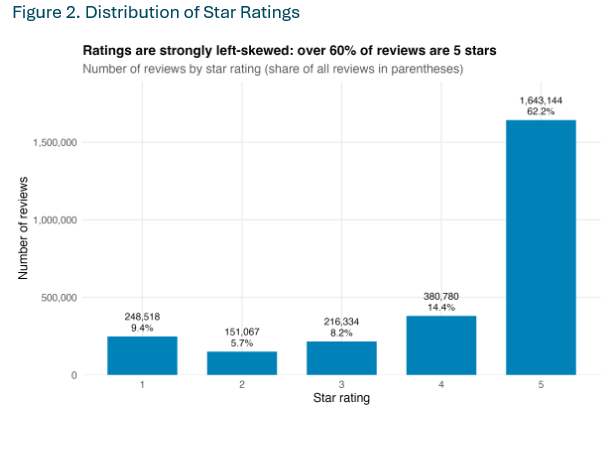
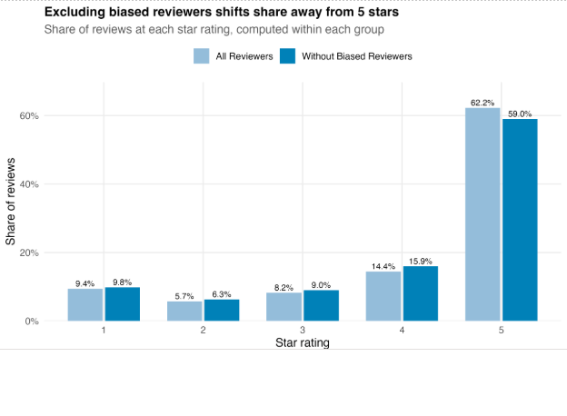

# E-Commerce-Review-Intelligence-Pipeline
An end-to-end analytics project examining customer behavior, review quality, seasonality, and incentive-program effectiveness, across 2.6M+ e-commerce product reviews.
Python | MySQL| SQL | R | pandas

## Project Overview
Online marketplaces collect enormous amounts of customer feedback, but review volume alone does not necessarily translate into useful insight. Understanding how customers rate products, whether different types of reviewers behave differently, and when review activity changes can help businesses interpret marketplace feedback more effectively.

This project analyzed more than **2.6 million e-commerce product reviews** through an end-to-end analytics workflow spanning Python, MySQL, SQL, and R.

The analysis explored several dimensions of marketplace review behavior, including:

- whether verified purchasers rate products differently from non-verified reviewers;
- how customer ratings are distributed across the 1–5 star scale;
- whether reviewers displaying unusually extreme rating behavior materially influence the overall rating distribution; and
- whether review activity exhibits recurring seasonal patterns.

Rather than processing the full dataset locally, the workflow used a remote MySQL database for data preparation and aggregation. Python was then used to extract analysis-ready results from the database, while R was used to visualize and interpret the resulting patterns.

## Analytics Workflow
2.6M+ Marketplace Reviews
          │
          ▼
   Remote MySQL Database
          │
          ▼
 SQL Cleaning & Aggregation
          │
          ▼
 Analysis-Ready Tables
          │
          ▼
 Python Extraction Utility
          │
          ▼
      Local CSVs
          │
          ▼
 R Analysis & Visualization
          │
          ▼
    Business Insights

## My Contribution
This was a collaborative analytics project. My primary contribution focused on the **SQL-to-analysis portion of the workflow**, including the database extraction process and several downstream analyses.

I contributed to:

- **Building a reusable Python extraction utility** that connects to a remote MySQL database and exports selected analytical tables to local CSV files.
- Implementing command-line parameters, YAML-based database configuration, logging, exception handling, and file-overwrite protection to make the extraction process reusable across multiple analytical outputs.
- Preparing and working with SQL outputs for analyses covering **verified purchase behavior, rating distribution, reviewer rating bias, and review seasonality**.
- Developing R visualizations to communicate these patterns and translate analytical results into understandable business insights.
- Contributing to the interpretation and communication of findings within the final analysis.

## Key Findings
## 1. Verified Purchasers Rated Products More Positively
To understand whether purchasing context was associated with rating behavior, average ratings were compared across all reviewers, verified purchasers, and non-verified reviewers.

| Reviewer Group | Average Rating |
|---|---:|
| Overall | **4.16** |
| Verified Purchase | **4.18** |
| Non-Verified Purchase | **3.86** |

Verified purchasers rated products approximately **0.32 stars higher** than non-verified reviewers on average.

### Takeaway

Purchase verification appears to be associated with somewhat more positive ratings. This suggests that verified-purchase status can provide useful context when businesses interpret marketplace review scores rather than treating all ratings as behaviorally identical.

---

## 2. Customer Ratings Were Strongly Concentrated at the Top

Average ratings alone can hide the underlying shape of customer sentiment, so the full distribution of ratings was examined.



The distribution was heavily concentrated toward positive ratings:

- **62.2%** of reviews received 5 stars.
- **14.4%** received 4 stars.
- Together, 4- and 5-star reviews represented approximately **76.6%** of the dataset.
- 1-star reviews represented approximately **9.4%** of reviews.

### Takeaway

Customer sentiment in the dataset was overwhelmingly positive, but the strong concentration of 5-star reviews also means that a single average rating does not fully describe reviewer behavior. Looking at the complete distribution provides a more informative picture of marketplace sentiment.

---

## 3. Extreme Reviewer Behavior Had a Measurable — but Limited — Effect

Some reviewers may consistently use only the extremes of the rating scale. To explore whether this behavior was influencing the overall distribution, a behavioral rule was created to identify potentially biased reviewers.

A reviewer was flagged when they:

- had submitted at least **five reviews**, and
- gave either a **1-star or 5-star rating in at least 80%** of those reviews.

The rating distribution was then recalculated after excluding those reviewers.



The largest change occurred among 5-star reviews, whose share declined from approximately **62.2% to 59.0%** after potentially biased reviewers were removed.

However, the overall shape of the distribution remained similar.

### Takeaway

Extreme-rating reviewers contributed to the dataset's concentration of 5-star reviews, but they did **not fully explain the broader positive rating pattern**. This suggests that the strong positive skew was a characteristic of the overall review population rather than being driven solely by a relatively small group of highly polarized reviewers.

---

## 4. Review Activity Showed Clear Seasonal Patterns

Review volume increased substantially over time, making raw monthly counts difficult to compare directly across years.

To separate **seasonality from overall platform growth**, monthly review activity was normalized relative to the average month within each year.


The resulting seasonal pattern showed that:

- review activity generally weakened during the spring and early summer;
- activity began increasing during the second half of the year; and
- **December consistently represented the strongest review month**, reaching roughly 65% above an average month in the seasonal analysis.

### Takeaway

Review activity appears to follow a recurring annual cycle rather than being evenly distributed throughout the year.

For marketplace teams, this means changes in review volume should be interpreted relative to normal seasonal behavior. A month-over-month increase or decrease may reflect expected customer activity rather than a fundamental change in product performance.

---

# From Database to Analysis

One of my primary technical contributions was developing the Python workflow used to move analytical results from the remote database into the visualization environment.

The reusable command-line utility allows a user to specify:

```text
--table       Database table to retrieve
--outfile     Destination CSV file
--config      Database configuration file
--force       Optionally replace an existing output file
```

For example:

```bash
python download.py \
    --table analysis_table \
    --outfile analysis_table.csv \
    --config connection.yaml
```

The script:

1. reads database settings from a YAML configuration file;
2. establishes a MySQL connection using SQLAlchemy and PyMySQL;
3. retrieves the requested table into a pandas DataFrame;
4. exports the results to CSV for downstream analysis;
5. records progress and errors using Python's logging module; and
6. safely closes the database connection when processing is complete.

The extraction workflow was first validated against a small database test table before being used with analytical outputs.

This created a reusable bridge between the project's **database processing layer and visualization layer**, rather than requiring tables to be manually exported each time an analysis was updated.

---

# Analytical Approach

### SQL — Prepare

SQL was used to perform data-intensive operations within the database and create smaller analysis-ready result tables.

For my analysis areas, this included:

- calculating average ratings by purchase-verification status;
- aggregating review counts by star rating;
- identifying reviewers exhibiting extreme rating behavior;
- comparing rating distributions with and without those reviewers; and
- aggregating review activity by month and year.

### Python — Extract

Python provided the reusable interface between the remote database and local analytical environment.

Key tools included:

- **pandas** for database results and CSV output;
- **SQLAlchemy + PyMySQL** for MySQL connectivity;
- **PyYAML** for external database configuration;
- **argparse** for command-line parameters; and
- **logging** for execution and error reporting.

### R — Visualize & Interpret

R and `ggplot2` were used to transform the analysis-ready outputs into visualizations that made behavioral patterns easier to interpret and communicate.

---

# Repository Structure

```text
marketplace-review-intelligence/
│
├── README.md
├── .gitignore
├── requirements.txt
│
├── config/
│   └── connection.example.yaml
│
├── src/
│   ├── python/
│   │   └── download.py
│   │
│   ├── sql/
│   │   └── review_analysis.sql
│   │
│   └── r/
│       └── analysis_visualizations.R
│
└── images/
    ├── verified_purchase.png
    ├── rating_distribution.png
    ├── reviewer_bias.png
    └── review_seasonality.png
```

---

# Running the Extraction Utility

### 1. Install Python dependencies

```bash
pip install -r requirements.txt
```

### 2. Configure the database connection

A template is provided at:

```text
config/connection.example.yaml
```

Create a local `connection.yaml` containing your own database settings:

```yaml
user: YOUR_USERNAME
password: YOUR_PASSWORD
hostname: YOUR_DATABASE_HOST
port: 3306
schema: YOUR_DATABASE
```

Database credentials are intentionally excluded from this repository.

### 3. Download an analytical table

```bash
python src/python/download.py \
    --table TABLE_NAME \
    --outfile OUTPUT.csv \
    --config connection.yaml
```

Use `--force` if an existing output file should be replaced.

---

# Tools & Skills

**Languages & Analytics**

`Python` · `SQL` · `R`

**Data & Database**

`MySQL` · `pandas` · `SQLAlchemy` · `PyMySQL`

**Visualization**

`ggplot2` · `tidyverse`

**Workflow**

Command-line tools · YAML configuration · Database extraction · Data aggregation · Exploratory analysis · Data visualization · Business interpretation

---

# Project Takeaway

The project reinforced that working with large datasets is not only about producing calculations or visualizations. The structure of the analytical workflow matters just as much.

Keeping large-scale preparation in SQL, creating reusable mechanisms for transferring analytical outputs, and then using R primarily for visualization created a cleaner separation between **data processing, analysis, and communication**.

The analysis also demonstrated the importance of looking beyond headline metrics. Average ratings, raw review counts, and total activity can tell very different stories once reviewer behavior, distribution shape, and seasonality are considered.

---

## Collaboration

This project was completed collaboratively. The repository focuses on the components and analyses I personally contributed to, while the broader project involved shared work across data ingestion, database cleaning, SQL analysis, visualization, and interpretation.
