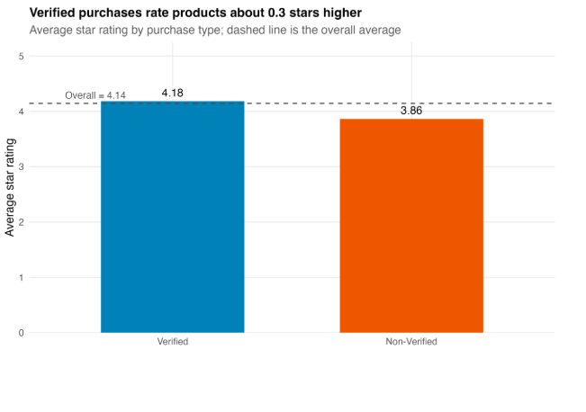
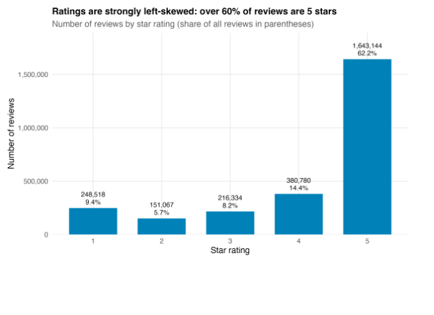
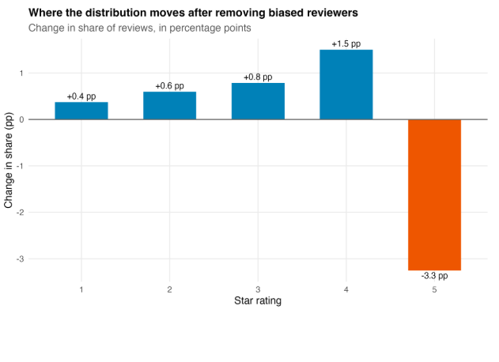
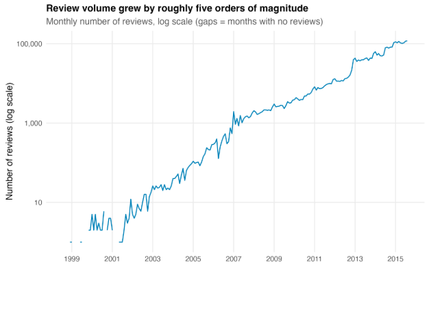
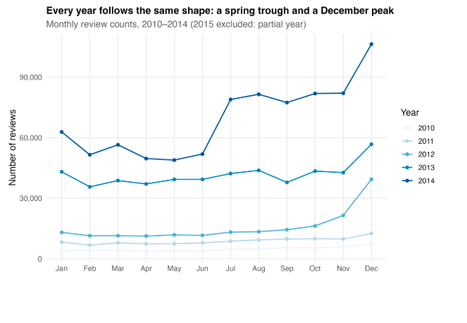
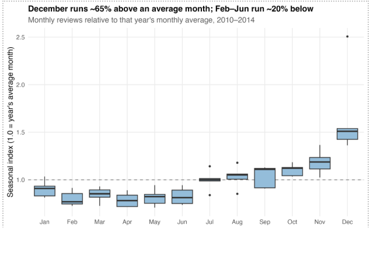

# E-Commerce-Review-Intelligence-Analytics
An end-to-end analytics project examining customer behavior, review quality, seasonality, and incentive-program effectiveness, across 2.6M+ e-commerce product reviews.

Python | MySQL | SQL | R | pandas

## Project Overview
Online marketplaces collect enormous amounts of customer feedback, but review volume alone does not necessarily translate into useful insight. Understanding how customers rate products, whether different types of reviewers behave differently, and when review activity changes can help businesses interpret marketplace feedback more effectively.

This project analyzed more than **2.6 million e-commerce product reviews** through an end-to-end analytics workflow spanning Python, MySQL, SQL, and R. The analysis focused on four areas: verified vs. non-verified ratings, the overall rating distribution, the impact of potentially biased reviewers, and recurring seasonal changes in review activity.

To handle the dataset efficiently, heavier processing and aggregation were completed in MySQL, Python was used to extract analysis-ready tables, and R was used for visualization and interpretation.

## Collaboration
This project was completed collaboratively. The repository focuses on the components and analyses I personally contributed to, while the broader project involved shared work across data ingestion, database cleaning, SQL analysis, visualization, and interpretation.

My primary contribution includes:
- **Building a reusable Python extraction utility** that connects to a remote MySQL database and exports selected analytical tables to local CSV files.
- Preparing and working with SQL outputs for analyses covering **verified purchase behavior, rating distribution, reviewer rating bias, and review seasonality**.
- Developing R visualizations to communicate these patterns and translate analytical results into understandable business insights.
- Contributing to the interpretation and communication of findings within the final analysis.

## Key Findings
## 1. Verified Purchasers Rated Products More Positively

First, compared average ratings across verified and non-verified purchases to determine whether purchasing context was associated with rating behavior.



The overall average product rating was **4.14 stars**. Breaking the reviews apart revealed a noticeable difference:

| Purchase Status | Average Rating |
|---|---:|
| Verified | **4.18** |
| Non-Verified | **3.86** |
| Difference | **+0.32** |

A 0.32-star difference may appear modest on a five-point scale, but marketplace ratings are already concentrated toward the upper end of the scale. The overall mean also sits much closer to the verified-purchase average, indicating that verified reviews make up much of the dataset and strongly influence the headline rating.

### Takeaway

Verified purchasers were associated with **more positive rating behavior**, but this should not be interpreted as evidence that verification itself causes higher ratings. Purchase verification provides important context when interpreting marketplace ratings, but the relationship is associative rather than causal.

---

## 2. The Average Rating Hides a Highly Polarized Distribution

An overall average of 4.14 stars suggests broadly positive sentiment - but the full distribution tells a more interesting story.



The distribution is heavily concentrated at the top of the rating scale:

| Rating | Reviews | Share |
|---:|---:|---:|
| 1 ★ | 248,518 | **9.4%** |
| 2 ★ | 151,067 | **5.7%** |
| 3 ★ | 216,334 | **8.2%** |
| 4 ★ | 380,780 | **14.4%** |
| 5 ★ | 1,643,144 | **62.2%** |

**4- and 5-star ratings account for 76.6% of all reviews**, while 5-star reviews alone represent nearly two-thirds of the dataset.

But there is another interesting feature: **1-star reviews are more common than either 2- or 3-star reviews.**

The middle of the scale is relatively thin, with 2- and 3-star reviews together representing only **13.9%** of reviews.

### Takeaway

The distribution behaves less like a smooth measure of satisfaction and more like a **polarized customer-response signal**.

Customers appear especially likely to leave reviews when they are very satisfied - and, to a lesser extent, when they are very dissatisfied.

This also means the average rating should be interpreted carefully. A relatively small change in the mean could reflect a shift in the proportion of extreme ratings rather than a broad change in customer sentiment.

---

## 3. Are Extreme Reviewers Driving the Positive Ratings?

The strongly top-heavy rating distribution raised another question:

> Could a relatively small group of reviewers who repeatedly give extreme ratings be distorting the marketplace's overall rating profile?

Because reviewer bias cannot be directly observed, I used a behavioral definition to identify **potentially biased reviewers**.

A reviewer was flagged when they:

- submitted at least **5 reviews**, and
- gave either a **1-star or 5-star rating in at least 80%** of those reviews.

The five-review requirement provides enough observations to identify a repeated pattern, while the 80% threshold captures consistently extreme behavior without requiring every review to be extreme.

Importantly, this is a **behavioral flag - not proof that an individual reviewer is objectively biased**.

### Comparing the Rating Distributions


After excluding the flagged reviewers:

| Rating | All Reviewers | Without Flagged Reviewers | Change |
|---:|---:|---:|---:|
| 1 ★ | 9.4% | 9.8% | **+0.4 pp** |
| 2 ★ | 5.7% | 6.3% | **+0.6 pp** |
| 3 ★ | 8.2% | 9.0% | **+0.8 pp** |
| 4 ★ | 14.4% | 15.9% | **+1.5 pp** |
| 5 ★ | 62.2% | 59.0% | **−3.3 pp** |

The implied average rating declined from approximately **4.14 to 4.08 stars**.

### Where Did the Distribution Move?



The second view makes the direction of the change clearer.

**Five stars was the only rating category that lost share.**

Every other rating gained share after the flagged reviewers were removed.

That asymmetry is important. The behavioral rule captures extreme reviewers at **both ends** of the scale, yet removing them primarily reduces 5-star ratings.

### Takeaway

Potentially biased reviewers appear to contribute some **upward pressure** to marketplace ratings, but the effect is relatively small.

Even after removing them:

- 5 stars remains by far the most common rating;
- 4- and 5-star ratings still represent approximately **74.9%** of reviews; and
- the overall shape of the distribution remains strongly positive.

Therefore, the marketplace's positive rating pattern is **not simply an artifact of a small group of extreme reviewers**.

A more interesting finding is the direction of the effect: among frequent reviewers who repeatedly use the extremes of the rating scale, extreme positivity appears more prevalent than extreme negativity.

### Limitation

This metric identifies unusual rating behavior, not intent.

A customer who genuinely loved five consecutive products could be flagged in exactly the same way as someone exhibiting systematic rating bias. Different minimum-review or extreme-rating thresholds could also identify different populations.

The result should therefore be interpreted as a **sensitivity analysis of reviewer behavior**, not a definitive classification of individual reviewers.

---

## 4. Review Activity Grew Dramatically - But Growth and Seasonality Are Different Stories

The final analysis examined how marketplace review activity changed over time.

### Long-Term Growth



Monthly review volume grew by roughly **five orders of magnitude**, from only a handful of reviews per month in the earliest years to more than **100,000 reviews per month by mid-2015**.

Because that growth is so large, the visualization uses a logarithmic scale. On a standard linear scale, the early years would be compressed near zero and the underlying pattern would be difficult to see.

The approximately linear pattern on the log scale indicates growth closer to **exponential than linear** over much of the period.

Visible level changes also appear around 2013 and 2014, suggesting that marketplace growth was not perfectly smooth.

But this creates a problem for seasonality analysis:

> If every year is dramatically larger than the previous one, how can we tell whether December is genuinely unusual or simply belongs to a later, larger year?

---

### Comparing the Shape of Each Year

To isolate recurring within-year behavior, I focused on **2010–2014**.

Earlier years contained too few observations for stable monthly comparisons, while 2015 was excluded because the dataset ends partway through the year.



Plotting each year separately reveals a recurring shape:

- activity softens during the spring;
- begins rebuilding during the second half of the year; and
- rises sharply toward December.

However, raw counts still make direct comparisons difficult because 2014 contains far more reviews than 2010.

So one additional normalization step was needed.

---

### Normalizing for Marketplace Growth

For each year, monthly review volume was divided by that year's average monthly review count:

```text
Seasonal Index =
Monthly Review Volume
────────────────────────
Average Month in Same Year
```

An index of:

- **1.0** = typical month for that year
- **> 1.0** = above-average month
- **< 1.0** = below-average month



After controlling for the enormous differences in annual scale, the recurring seasonal pattern becomes much clearer.

Across 2010–2014:

- **December** was approximately **65% above an average month** and represented about **13.9% of annual reviews**.
- **November** represented approximately **9.9%** of annual activity.
- **October** represented approximately **9.2%**.
- February through June formed a recurring trough at roughly **20% below an average month**.
- **April (6.6%)** and **February (6.7%)** were among the lowest-volume months.
- Activity generally increased from July through the end of the year.

### Takeaway

Marketplace review activity demonstrates a clear recurring annual pattern:

**spring trough → second-half recovery → December peak**

The important analytical distinction is that **long-term marketplace growth and seasonality are separate effects**.

Raw monthly counts alone could easily confuse the two. Normalizing each month relative to its own year's activity makes it possible to compare seasonal behavior despite enormous differences in platform scale.

The December peak is consistent with holiday-period purchasing behavior, although review dates represent when customers submitted reviews rather than when purchases occurred. The pattern therefore reflects the seasonality of **review activity**, which may lag purchasing behavior.

---

## Technical Implementation

### SQL - Prepare Analysis-Ready Data

Rather than moving millions of records into R, SQL was used to perform the heavier aggregation work within MySQL.

For the analyses presented here, SQL was used to: calculate average ratings by verification status; aggregate review counts by star rating; identify reviewers meeting the extreme-rating behavioral criteria; recalculate rating distributions after excluding those reviewers; and aggregate review volume by month and year.

This produced smaller analytical tables designed specifically for downstream visualization.

---
# From Database to Analysis

One of my primary technical contributions was developing the Python workflow used to move analytical results from the remote database into the visualization environment.

The reusable command-line utility allows a user to specify:

```text
--table       Database table to retrieve
--outfile     Destination CSV file
--config      Database configuration file
--force       Optionally replace an existing output file
```

For example:

```bash
python download.py \
    --table analysis_table \
    --outfile analysis_table.csv \
    --config connection.yaml
```

The script:

1. reads database settings from a YAML configuration file;
2. establishes a MySQL connection using SQLAlchemy and PyMySQL;
3. retrieves the requested table into a pandas DataFrame;
4. exports the results to CSV for downstream analysis;
5. records progress and errors using Python's logging module; and
6. safely closes the database connection when processing is complete.

The extraction workflow was first validated against a small database test table before being used with analytical outputs.

This created a reusable bridge between the project's **database processing layer and visualization layer**, rather than requiring tables to be manually exported each time an analysis was updated.

---

# Analytical Approach

### SQL - Prepare

SQL handled the heavy processing and created analysis-ready tables for verified-purchase ratings, rating distributions, reviewer bias, and monthly review activity.

### Python - Extract

Python connected the remote MySQL database to the local analysis workflow. pandas, SQLAlchemy, PyMySQL, PyYAML, argparse, and logging supported database access, configurable extraction, CSV output, and execution tracking. 

### R - Visualize & Interpret

R and ggplot2 were used to visualize the prepared datasets and communicate the resulting customer and marketplace patterns.

---

# Repository Structure

```text
e-commerce-review-intelligence-analytics/
│
├── README.md
├── .gitignore
├── requirements.txt
│
├── config/
│   └── connection.example.yaml
│
├── src/
│   ├── python/
│   │   └── download.py
│   │
│   ├── sql/
│   │   └── analysis_review.sql
│   │
│   └── r/
│       └── analysis_visualizations.R
│
└── images/
    ├── verified_purchase.png
    ├── distribution.png
    ├── reviewer_bias.png
    └── ...
```

---

# Running the Extraction Utility

### 1. Install Python dependencies

```bash
pip install -r requirements.txt
```

### 2. Configure the database connection

A template is provided at:

```text
config/connection.example.yaml
```

Create a local `connection.yaml` containing your own database settings:

```yaml
user: YOUR_USERNAME
password: YOUR_PASSWORD
hostname: YOUR_DATABASE_HOST
port: 3306
schema: YOUR_DATABASE
```

Database credentials are intentionally excluded from this repository.

### 3. Download an analytical table

```bash
python src/python/download.py \
    --table TABLE_NAME \
    --outfile OUTPUT.csv \
    --config connection.yaml
```

Use `--force` if an existing output file should be replaced.

---

# Takeaway

The project reinforced that working with large datasets is not only about producing calculations or visualizations. The structure of the analytical workflow matters just as much.

Keeping large-scale preparation in SQL, creating reusable mechanisms for transferring analytical outputs, and then using R primarily for visualization created a cleaner separation between **data processing, analysis, and communication**.

The analysis also demonstrated the importance of looking beyond headline metrics. Average ratings, raw review counts, and total activity **can tell very different stories once reviewer behavior, distribution shape, and seasonality are considered**.
---


